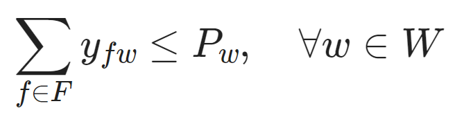

# Supply Chain Optimization Project

<table>
  <tr>
    <td>
      <h3>Give me the route</h3>
      
    </td>
    <td rowspan="2">
      
    </td>
  </tr>
  <tr>
    <td></td>
  </tr>
</table>

### Languages and Libraries

    
    

### Introduction

Supply chains are encountered in almost every field, and optimizing these processes can yield substantial financial benefits for businesses/companies. This chain encompasses the entire process from sourcing raw materials from suppliers, processing them in factories, storing them in warehouses, and finally delivering them to retailers. In this portfolio project, I will optimize this process using Linear Programming (LP) with Pyomo

The objective of this study is to minimize costs within a supply chain model while meeting the demands of retailers. The model aims to ensure that products are delivered at the lowest possible cost by optimizing the flow of goods between suppliers, production centers, warehouses, and retailers.

However, as you will see shortly, we will have some constraints to consider.

We have three different suppliers, production centers (factories), warehouses, and retailers. Each of these entities has distinct capacities and demands, as well as varying production, processing, storage, and sales costs.

<table>
<tr>
  <td>

  ### 1. Suppliers
  |  Supplier ID  |Production Capacity (tons)| Production Cost (USD/ton) |
  |---------------|--------------------------|---------------------------|
  | S1            | 5000                     | 10                        |
  | S2            | 6000                     | 12                        |
  | S3            | 4000                     | 11                        |

  </td>
  <td>

  ### 2. Production Centers (Factories)
  | Production Center ID | Capacity (tons) | Operating Cost (USD/ton) |
  |-------------------|----------------|---------------------------|
  | F1                | 7000           | 5                         |
  | F2                | 6000           | 6                         |
  | F3                | 5000           | 4                         |

  </td>
</tr>
<tr>
  <td>

  ### 3. Warehouses
  | Warehouses ID | Capacity (tons) | Storage Cost (USD/ton) |
  |---------|----------------|-----------------------------|
  | W1      | 3000           | 2                           |
  | W2      | 4000           | 3                           |
  | W3      | 5000           | 1.5                         |

  </td>
  <td>

  ### 4. Retailers
  | Retailers ID   | Demand (tons)| Sale Price (USD/ton) |
  |----------------|-------------|------------------------|
  | R1             | 4000        | 20                     |
  | R2             | 5000        | 18                     |
  | R3             | 6000        | 19                     |

  </td>
</tr>
</table>

In addition to the costs, transportation costs between each location also vary, and the cost data is presented in the table below

<table>
  <tr>
    <td>
      <table>
        <tr>
          <th>Supplier → Production Center</th>
          <th>F1</th>
          <th>F2</th>
          <th>F3</th>
        </tr>
        <tr>
          <td>S1</td>
          <td>3</td>
          <td>2.5</td>
          <td>3.5</td>
        </tr>
        <tr>
          <td>S2</td>
          <td>2</td>
          <td>2</td>
          <td>3</td>
        </tr>
        <tr>
          <td>S3</td>
          <td>3</td>
          <td>3.5</td>
          <td>2.5</td>
        </tr>
      </table>
    </td>
    <td>
      <table>
        <tr>
          <th>Production Center → WareHouse</th>
          <th>W1</th>
          <th>W2</th>
          <th>W3</th>
        </tr>
        <tr>
          <td>F1</td>
          <td>1.5</td>
          <td>2</td>
          <td>2.5</td>
        </tr>
        <tr>
          <td>F2</td>
          <td>2</td>
          <td>1.5</td>
          <td>2</td>
        </tr>
        <tr>
          <td>F3</td>
          <td>2.5</td>
          <td>2</td>
          <td>1.5</td>
        </tr>
      </table>
    </td>
    <td>
      <table>
        <tr>
          <th>WareHouse → Retailers </th>
          <th>R1</th>
          <th>R2</th>
          <th>R3</th>
        </tr>
        <tr>
          <td>W1</td>
          <td>1</td>
          <td>1.5</td>
          <td>2</td>
        </tr>
        <tr>
          <td>W2</td>
          <td>1.2</td>
          <td>1</td>
          <td>1.8</td>
        </tr>
        <tr>
          <td>W3</td>
          <td>1.5</td>
          <td>1.2</td>
          <td>1</td>
        </tr>
      </table>
    </td>
  </tr>
</table>

To make the operations a bit more challenging, we impose quotas on the factories. Accordingly, Factory1 can only use 70% of its capacity, Factory2 can use 100%, and finally, Factory3 can utilize 85% of its capacity.

In light of all this information, let’s summarize the system, parameters, variables, constraints, and objective function.

**Sets:**
- *S*: Suppliers Suppliers
- *F*: Factories
- *W*: Warehouses
- *R*: Retailers

**Parameters:**
- *P*s: __Production capacity for supplier s (tons)__
- *C*s: __Production cost for supplier s (USD/ton)__
- *P*f: __Capacity for factory f (tons)__
- *O*f: __Operating cost for factory f (USD/ton)__
- *P*w: __Capacity for warehouse w (tons)__
- *S*w: __Storage cost for warehouse w (TL/ton)__
- *D*r: __Demand for retailer r (tons)__
- *T*sf: __Transportation cost between supplier s and factory f (USD/ton)__
- *T*fw: __Transportation cost between factory f and warehouse w (USD/ton)__
- *T*wr: __Transportation cost between warehouse w and retailer r (USD/ton)__

**Variables:**
- *x*sf: __Raw materials sent from supplier s to factory f (tons)__
- *y*fw: __Products sent from factory f to warehouse w (tons)__
- *z*wr: __Products sent from warehouse w to retailer r (tons)__

## Objective Function
The goal is to minimize the total cost:

$$
\text{Minimize} \ Z = \sum_{s \in S} \sum_{f \in F} C_s \cdot x_{sf} + \sum_{f \in F} \sum_{w \in W} O_f \cdot y_{fw} + \sum_{w \in W} \sum_{r \in R} S_w \cdot z_{wr} + \sum_{s \in S} \sum_{f \in F} T_{sf} \cdot x_{sf} + \sum_{f \in F} \sum_{w \in W} T_{fw} \cdot y_{fw} + \sum_{w \in W} \sum_{r \in R} T_{wr} \cdot z_{wr}
$$

## Constraints
1. **Supplier Capacity Constraints**:
   The total raw materials sent by each supplier must not exceed its production capacity:
   $$
   \sum_{f \in F} x_{sf} \leq P_s, \quad \forall s \in S
   $$

2. **Factory Capacity Constraints**:
   The amount of raw materials received by each factory must not exceed its capacity. Additionally, the operating rate of each factory is restricted to a specific percentage:
   $$
   \sum_{s \in S} x_{sf} \leq P_f, \quad \forall f \in F
   $$

   
- *f* = *F*1: __∑s ∈ S *x*sF1 ≤ 0.7 ⋅ *P*F1__
- *f* = *F*2: __∑s ∈ S *x*sF2 ≤ 1.0 ⋅ *P*F2__
- *f* = *F*3: __∑s ∈ S *x*sF3 ≤ 0.85 ⋅ *P*F3__

3. **Warehouse Capacity Constraints**:
   The amount of products received by each warehouse must not exceed its capacity:

5. **Retailer Demand Constraints**:
   The demand of each retailer must be met by the products received from the corresponding warehouse:
   $$
   \sum_{w \in W} z_{wr} = D_r, \quad \forall r \in R
   $$

6. **Factory Input-Output Balance**:
   There must be a balance between the incoming and outgoing products for each factory:
   $$
   \sum_{s \in S} x_{sf} = \sum_{w \in W} y_{fw}, \quad \forall f \in F
   $$

7. **Warehouse Input-Output Balance**:
   There must be a balance between the incoming and outgoing products for each warehouse:
   $$
   \sum_{f \in F} y_{fw} = \sum_{r \in R} z_{wr}, \quad \forall w \in W
   $$

# Optimization Result

